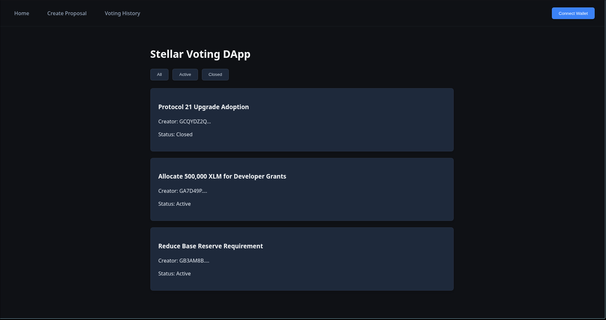
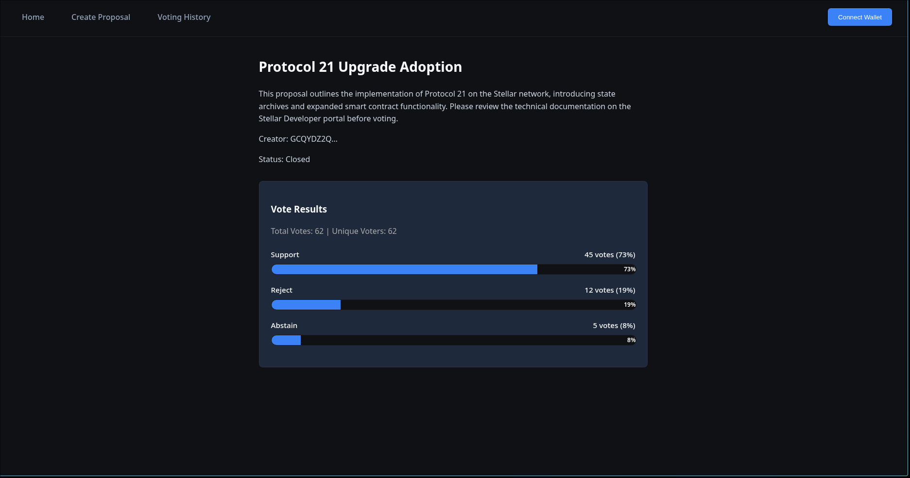
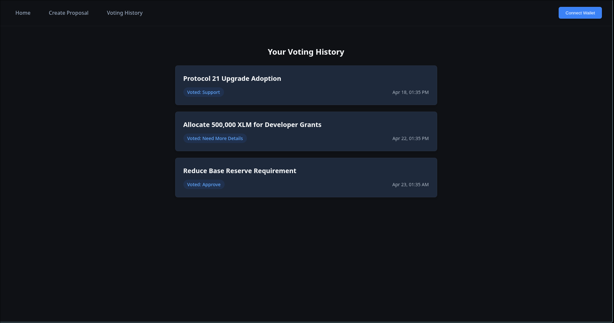

# Stellar Voting DApp

A decentralized voting system built on the Stellar blockchain using Soroban smart contracts. This application enables transparent, tamper-proof voting where users authenticate via Freighter wallet, create proposals, cast votes, and view results in real-time.

## Project Structure

```
stellar-voting-dapp/
├── contracts/          # Soroban smart contracts (Rust)
│   └── voting-contract/
├── frontend/           # React TypeScript application
└── backend/            # Optional backend API (Node.js/Python)
```

## Prerequisites

### For Smart Contracts

- Rust 1.74 or later
- Soroban CLI (`cargo install --locked soroban-cli`)
- Stellar account with testnet XLM

### For Frontend

- Node.js 18 or later
- npm or yarn
- Freighter wallet browser extension

### For Backend (Optional POC)

- Node.js 18+ or Python 3.10+
- PostgreSQL 14+ (if extending beyond the in-memory POC)

## Getting Started

### 1. Backend Development (Optional POC)

We've implemented a lightweight Node.js Express backend that mocks the smart contract interaction for fast local development and testing without deploying a smart contract to the Stellar testnet.

```bash
cd backend

# Install dependencies
npm install

# Start the POC backend server (runs on port 3001)
npm run dev
```

The frontend will automatically fall back to using this local Node.js backend if no `VITE_CONTRACT_ID` is provided in your environment variables.

### 2. Smart Contract Development

```bash
cd contracts

# Build the contract
cargo build --target wasm32-unknown-unknown --release

# Run tests
cargo test

# Deploy to testnet (requires Soroban CLI)
soroban contract deploy \
  --wasm target/wasm32-unknown-unknown/release/voting_contract.wasm \
  --source <YOUR_SECRET_KEY> \
  --network testnet
```

### 3. Frontend Development

```bash
cd frontend

# Install dependencies
npm install

# Start development server
npm run dev

# Run tests
npm test

# Build for production
npm run build
```

## Architecture

### Smart Contract (Soroban)

- Written in Rust using Soroban SDK
- Manages all voting logic on-chain
- Stores proposals and votes immutably
- Emits events for proposal creation and vote casting

### Frontend (React + TypeScript)

- User interface for wallet connection, proposal browsing, and voting
- Integrates with Freighter wallet for authentication
- Communicates directly with Soroban contracts via Stellar SDK
- Real-time vote count updates
- Falls back to local Node.js backend if `VITE_CONTRACT_ID` is unset

### Backend (POC / Optional)

- Acts as an in-memory mock/cache for blockchain data for local development
- Provides REST API for proposal queries and mock voting
- Syncs with blockchain events periodically (Planned for Production version)

## Features

- **Wallet Authentication**: Connect using Freighter wallet
- **Proposal Creation**: Create governance proposals with voting periods
- **Voting**: Cast votes on active proposals
- **Vote Immutability**: All votes permanently recorded on blockchain
- **Real-time Results**: View live vote counts and final results
- **Voting History**: Track your participation in governance
- **Transparent**: All data publicly queryable on Stellar blockchain

## Screenshots

  
  
  

## Testing

### Smart Contract Tests

```bash
cd contracts
cargo test
```

### Frontend Tests

```bash
cd frontend
npm test
```

## Configuration

### Frontend Environment Variables

Create a `.env` file in the `frontend` directory:

```env
VITE_STELLAR_NETWORK=testnet
VITE_STELLAR_RPC_URL=https://soroban-testnet.stellar.org
VITE_CONTRACT_ID=<your_deployed_contract_id>
```
